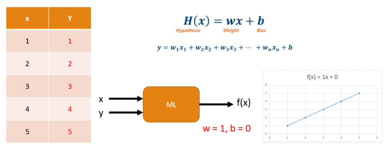
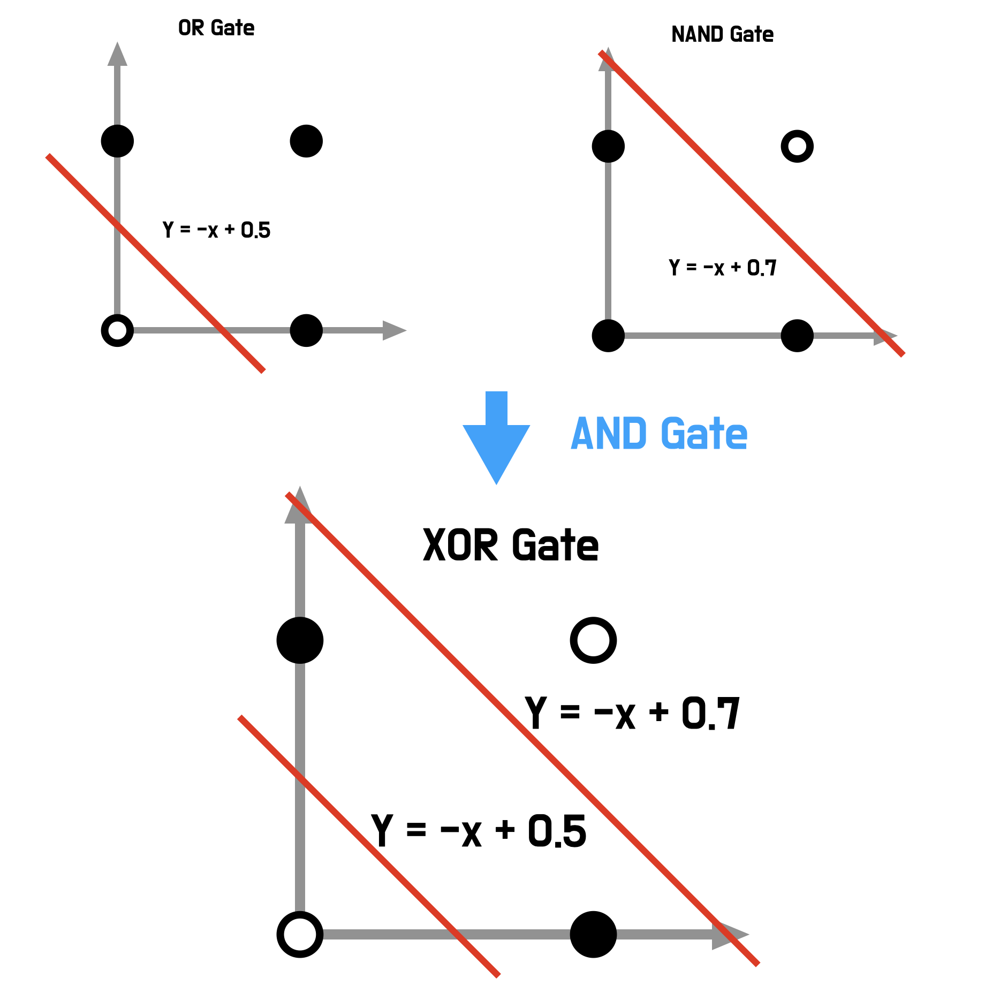
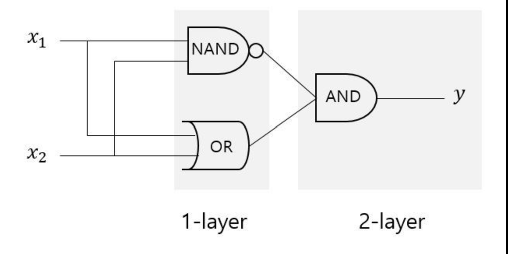
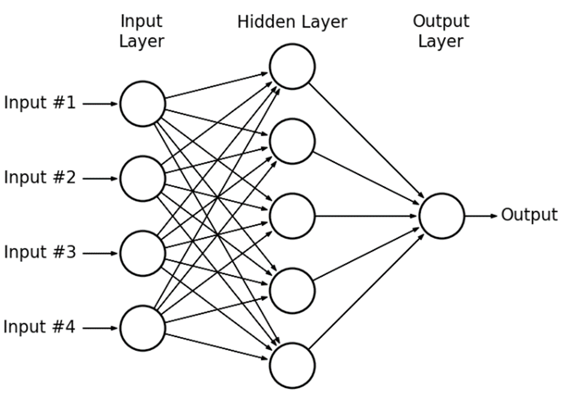

# Deep Learning Tutorial
## Ref.
- [Collado, Julian, et al. "Learning to identify electrons." Physical Review D 103.11 (2021): 116028.](https://journals.aps.org/prd/abstract/10.1103/PhysRevD.103.116028)
- [`Introduction to Machine Learning - CERN Indico`](https://indico.cern.ch/event/1170064/attachments/2479920/4256927/vlimant_CERN-SSL_July22.pdf)
## IAM
- 한상곤(Sangkon Han, sangkon@pusan.ac.kr), CS.

---
## Day.1 (Intro) Overview
- 논문(`Learning to Identify Electrons`) 재현에 필요한 기술 확인
- Hands-On CNN
### Index
- Day.2 : (Example) - [`LeNet-5`](http://vision.stanford.edu/cs598_spring07/papers/Lecun98.pdf) 구현해보기
- Day.3 : (execrcise) - [`Learning to Identify Electrons`]((https://journals.aps.org/prd/abstract/10.1103/PhysRevD.103.116028)) 재현 준비
- Day.4 : (execrcise) - [`Learning to Identify Electrons`]((https://journals.aps.org/prd/abstract/10.1103/PhysRevD.103.116028)) 재현
- Day.5 : (practice) - [`Learning to Isolate Muons`](https://link.springer.com/article/10.1007/JHEP10(2021)200) 재현

---
## 0. 논문(`Learning to Identify Electrons`) 구성 살펴보기

---
## 0.1 Ab.
- [state-of-the-art, SOTA](https://paperswithcode.com/sota)를 활용해서 [분류(classification)](https://www.tensorflow.org/tutorials/keras/classification?hl=ko) 하는 과정에서 입자가속기에서 jet backgrounds와 전자를 불류하는 과정에서 `정보를 손실`이 있을 것으로 예상.
- [CNN](https://www.tensorflow.org/tutorials/images/cnn?hl=ko)은 일반적인 기능의 성능과 비교하여 약 5%의 차이를 나타내고 있으며,`lower-level` 데이터에 대한 분류 능력이 부족한 것이 원인이라 판단함.
- 사용되지 않는 정보의 `특성`을 밝히기 위해 최근 개발된 기술을 사용함.
- 본 논문은 일반적으로 전자를 식별하는데 사용되지 않지만 CNN의 성능 격차를 `거의 줄이는` `두 가지 간단한 접근 방법`을 제시함.

---
# 0.2 결론적으로 다음과 같은 기술을 요구
- 딥러닝(그 중에서 CNN)
- 이미지(Image) 처리
- 데이터(LL, HL) 다루기
- 그래프(Graph) 작성

---
# 0.3 실험 환경 구성

---
## *실험 환경 구성의 주의사항
> "Replication — The confirmation of results and conclusions from one study obtained independently in another — is considered the scientific gold standard." - JASNY, Barbara R., et al. Again, and again, and again…. Science, 2011, 334.6060: 1225-1225.

---
## 0.3.a Python을 활용한 실험 구성의 핵심 - `가상화`
```
$ python -m venv venv
$ .\venv\Scripts\activate # windows
$ (venv) python
Python 3.10.9 (tags/v3.10.9:1dd9be6, Dec  6 2022, 20:01:21) ...
Type "help", "copyright", "credits" or "license" for more information.
>>>
```

---
## 0.3.b 필수 라이브러리 설치
```
$ (venv) python -m pip install -U pip setuptools wheel
$ (venv) pip install jupyterlab
$ (venv) pip install pandas
$ (venv) pip install scikit-learn
$ (venv) pip install tensorflow
$ (venv) pip install seaborn
$ (venv) pip install energyflow
$ (venv) pip freeze > requirements.txt
```

---
## 0.3.c 라이브러리 재현 가능성 테스트

```
$ (venv) pip install -r requirements.txt
```

---
## 0.3.d 실행
```
$ (venv) jupyter-lab
```

---
## 1. Hands-On Deep Learning

---
## 1.1 Supervised learning(지도학습)
> Supervised learning is a `machine learning` paradigm for problems [...]. The goal of supervised learning algorithms is learning a function [...] based on example `input-output pairs`.



---
## 1.2 Deep Learning
> Deep learning allows computational models that are `composed of multiple processing layers` to learn representations of data with multiple levels of abstraction. - LeCun, Yann, Yoshua Bengio, and Geoffrey Hinton. "Deep learning." nature 521.7553 (2015): 436-444.

---
## 1.3 Perceptron
예제) AND, NAND, OR


---
## 1.3.a A.I. Winter
단일 퍼셉트론(Perceptron)으론 해결 불가


---
## 1.3.b 해결 방법
유제) XOR

## 1.3.c Multilayer Perceptron


---
## 1.4 Let's Start Hands-On

---
## Review

- `Supervised learning`
    - Input, Output
- `Deep Learning`
    - Layer 설계

## NEXT

이미지의 특징을 추출하는 딥러닝 방법 중 가장 대표적인 것이 `CNN`
    