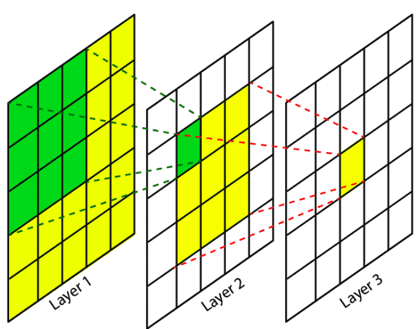
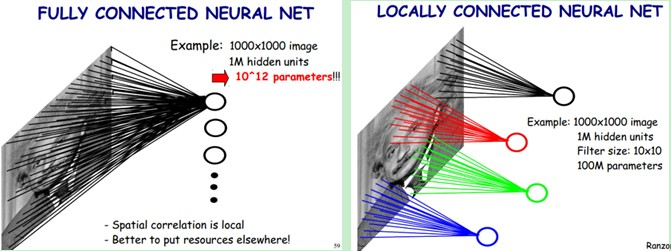

# Deep Learning Tutorial #2
## Ref.
- [LeCun, Yann, et al. "Gradient-based learning applied to document recognition." Proceedings of the IEEE 86.11 (1998): 2278-2324.](https://ieeexplore.ieee.org/stamp/stamp.jsp?arnumber=726791)
## IAM
- 한상곤(Sangkon Han, sangkon@pusan.ac.kr), CS.

---
## Day.2 (Example) LeNet-5 구현해보기

> LeNet-5로 알려져 있는 `Gradient-based learning applied to document recognition.` 논문 구현

### Index
- ~~Day.1 : (Intro) - [Hands-On](https://github.com/sigmadream/learning-to-identify-electrons-clone/blob/main/notebooks/day1-hands-on.ipynb)~~
- **Day.2 : (Example) - [`LeNet-5`](http://vision.stanford.edu/cs598_spring07/papers/Lecun98.pdf) 구현해보기**
- Day.3 : (execrcise) - [`Learning to Identify Electrons`]((https://journals.aps.org/prd/abstract/10.1103/PhysRevD.103.116028)) 재현 준비
- Day.4 : (execrcise) - [`Learning to Identify Electrons`]((https://journals.aps.org/prd/abstract/10.1103/PhysRevD.103.116028)) 재현
- Day.5 : (practice) - [`Learning to Isolate Muons`](https://link.springer.com/article/10.1007/JHEP10(2021)200) 재현

---
## Review #1
- Python을 활용한 실험환경 구성
    - `격리`(venv, conda)를 통한 재현
- 딥러닝
    - 퍼셉트론(혹은 인공신경)을 하나의 레이어(layer, 층)로 활용하여 여러 계층을 구성하여 학습을 진행하는 방식
- 딥러닝 프로젝트의 3가지 기본 구성
    - 데이터, 훈련, 평가

---
## Review #2

- 은닉층을 여러개 쌓아 올린 인공 신경망을 심층 신경망(deep neural network, DNN)라 함
- 훈련(학습)이란 훈련 데이터로부터 `가중치 매개변수`의 최적값을 자동으로 획득하는 것으로 학습 결과는 `손실 함수`에 의해서 결정

---
## Review #3
- 초기 다층 신경망은 기울기 소실 문제로 훈련이 잘 되지 않음
- 1986년, 데이비드 루멜하트, 제프리 힌턴, 로날드 윌리엄스가 역전파 훈련 알고리즘을 소개
    - Rumelhart, David E., Geoffrey E. Hinton, and Ronald J. Williams. Learning internal representations by error propagation. California Univ San Diego La Jolla Inst for Cognitive Science, 1985.
- 네트워크를 두 번(정방향 한 번, 역방향 한 번) 통과 하는 것만으로 모든 모델 파라미터에 대한 네트워크 오차의 그레이디언트를 계산할 수 있는 방식을 제공 
- 오차를 감소시키기 위해 각 연결 가중치와 편향값이 어떻게 바뀌어야 하는지 알 수 있음

---
## 0. 논문(`Gradient-based learning applied to document recognition.`) 살펴보기

---
## 0.1 Ab.
- `Gradient-Based Learning Applied to Document Recognition`은 약 45p 정도이며, 문자 인식 업무에 `CNN`(convolutional neural network, 합성곱 신경망)이 효과적인 이유에 대해 기술.
- `LeNet-5`은 1998년 `Yann LeCun`의 논문 'Gradient-Based Learning Applied to Document Recognition'에 담겨있는 CNN 구조를 뜻함
> 우리는 CNN 구조 중에서 많은 연구자들이 인용하고 있고, CNN과 관련된 기초적인 정보를 제공하는 해당 논문을 통해서 LeNet-5 직접 구현과 동시에 CNN에 대한 이해도를 높여보는 것이 목표
## 0.2 실험 환경은 `Day1` 참고
- 실험 환경 구성이 힘들다면 [colab](https://colab.research.google.com/)을 활용

---
## 1. Gradient-Based Learning Applied to Document Recognition

LeNet-5은 Yann LeCun이 손으로 적힌 우편 번호를 기계적으로 확인하기 위해 고안된 CNN 구조를 말하는 것으로, 패턴 인식에서 이용되는 전통적인 모델은 `hand-designed feature extractor`로 특징을 추출하고, `fully-connected multi-layer networks`를 분류기로 사용

* 참고
    * LeCun, Yann, Yoshua Bengio, and Geoffrey Hinton. "Deep learning." nature 521.7553 (2015): 436-444.
    * Yann LeCun(Meta), Geoffrey Hinton(Google), Yoshua Bengio(SAMSUNG)

---
## 1.1.a 기존 방식의 문제점
- `Hand-designed feature extractor`는 제한된 특징만 추출 하지만, Yann LeCun은 `feature extractor` 그 자체에서 학습이 이루어 져야 한다고 주장
    - hand-designed feature extractor는 입력에서 관련 정보만 수집하고 무관한 정보를 `제거`
    - 이는 사람이 설계한 `feature extrator`가 추출한 정보만 분류기로 전달되므로 제한된 학습이 이루어짐

---
## 1.1.b 기존 방식의 문제점
- 하나의 이미지는 몇 백개의 변수(pixel)를 포함하고 있는데, fully-connected multi layer의 첫 번째 layer에 이미 몇 만개의 가중치를 포함
    - 많은 가중치를 저장해야 하므로 메모리 저장공간이 많이 필요하게 됨
    - 손글씨는 사람의 글쓰기 스타일에 따라 다르므로 많은 `distortion(왜곡)`와 `shift(이동)`가 생길텐데 fully-connected multi layer는 이러한 변동성과 관련된 결과값을 생성하도록 학습되지만, 입력 이미지 어디에서나 나타나는 `특징`을 검출하기 위해 `비슷한 가중치 패턴`을 가진 다수의 유닛으로 결과값을 출력해야 함
    - 이 모든 가중치 패턴을 학습하는 것은 많은 변동을 커버하기 위해 많은 학습 instance(개체)가 필요하게 됨

---
## 1.1.c 기존 방식의 문제점
- 입력값의 topology(위상)를 완전히 무시
    - 이미지는 2D 구조를 갖고 있으므로 인접한 변수(pixel)들은 공간적으로 매우 큰 상관관계가 있음
    - fully-connected multi layer는 인접한 변수들을 단순히 배열하여 학습하므로 공간적인 정보를 이용하지 못함

---
## 1.2 CNN 구조의 특징

CNN은 약간의 shift, scale, distortion 불변성을 갖기 위해 세 개의 아이디어인 Local receptive field, Shared-weight, sub-sampling을 결합

---
## 1.2.a Receptive Field(수용 영역)
- CNN은 `hidden unit`의 receptive field를 local로 제한함으로써 local featrue를 추출

- 하나의 layer는 이전 layer의 제한된 지역에 위치해 있는 유닛의 집합을 입력으로 사용
- 추출된 특징들은 고차원의 특징을 검출하기 위해 그 다음 layer에서 결합

---
## 1.2.b feature map
- 이를 통해 shift, distortion이 발생하더라도 특징을 나타내는 배열이 receptive field에 검출 된다면, 해당 특징을 반영한 `feature map`을 만들어 낼 수 있음
- receptive field를 이용하면 `parameter` **수를 줄일 수** 있게 됨


---
## 1.2.c shared weight(가중치 공유)
- feature map에 있는 unit은 동일한 weights와 bias를 공유하여 `convolution kernel`로 이용하여 입력의 모든 위치에서 동일한 특징을 추출
- 예를 들어, 5x5 kernel은 5x5사이즈와 설정된 Stride에 맞춰 feature map를 돌아다니며 계산하지만, 5x5의 weight와 1개의 bias만 back propagation으로 학습을 함

---
## 1.2.d shared weight의 장점
- weight를 공유하게 되면 학습 파라미터가 느는 것이 아니라, kernel를 총 몇개로 설정하는가에 따라 output인 feature map의 수와 학습해야하는 parameter만 증가
- 이 기법을 사용하면 요구되는 계산 capacity를 줄여주고, 학습할 `parameter`의 **수를 줄여줌**으로써 Overfitting를 방지하게 되어 test error와 training error 사이의 gap도 줄여줌
- 실제로 LeNet-5에는 340,908 connection이 존재하지만 60,000개의 trainable parameter만 존재
- 이 기법은 입력 이미지가 변환됬으면 `feature map`의 결과값도 동일한 양만큼 변화되기 때문에 CNN은 입력의 왜곡과 변환에 대한 Robust를 갖게 됨

---
## 1.2.e sub-sampling(혹은 pooling)
- sub-sampling은 현대의 pooling을 의미하는 것으로 LeNet-5에서는 average pooling을 이용
- 논문에선 한번 특징이 검출되면 위치 정보의 중요성이 떨어짐
    - 예를 들어, 입력 이미지가 7 이면 좌측 상당에 수평적인 end-point, 우측 상단에 corner, 이미지의 아래 부분에 수직적인 end-point를 포함
    - 이러한 각 특징의 위치 정보는 패턴을 식별하는 것과 무관할 뿐만 아니라, 입력값에 따라 특징이 나타나는 위치가 다를 가능성이 높기 때문에 잠재적으로 유해

---
## 1.2.f filter
- feature map으로 encoding 되는 특징들의 위치에 대한 정확도를 감소시키기 위한 가장 간단한 방법은 feature map의 해상도를 감소시키는 것
- sub-sampling layer에서 local average와 sub-sampling을 수행하여 feature map의 해상도를 감소시키고 distortion과 shift에 대한 민감도를 감소시킬 수 있다고 말함
- 위치 정보를 소실시키면서 생기는 손실은, feature map size가 작아질수록 더 많은 filter를 사용하여 다양한 feature를 추출하여 상호보완할 수 있도록 함

---
## LeNet-5의 구조

- LeNet-5는 32x32 크기의 흑백 이미지에서 학습된 7 layer Convolutional Neural Network 입니다.

<style>
img[alt~="center"] {
  display: block;
  margin: 0 auto;
}
</style>


> Conv(C1) - Subsampling(S2) - Conv(C3) - Subsampling(S4) - Conv(C5) - FC - FC

---
## LeNet-5 구현


---
## Step1. 만들고자 하는 구조를 미리 정의하라.
- 데이터
- 훈련
- 평가

---
## Step2. 데이터를 준비하고 전처리를 진행하라.
```python
import tensorflow as tf
data = tf.keras.datasets.mnist.load_data()
...
# why?
train_X = train_X.reshape((60000, 28, 28, 1))
test_X = test_X.reshape((10000, 28, 28, 1))
```

---
## Step2. 주의사항

> Tensorflow/PyTorch를 사용할 경우 이미지를 입력받는 형태는 (width, height, channel)로 표현

---
## Step3. 모델을 차례대로 구현하라.
### a.합성곱
CNN의 가장 중요한 구성 요소인 '합성곱 층'으로 `수용`영역에 있는 픽셀만 연결, 저수준에서 고수준으로 특성을 조합해서 나가도록 도와줌
```
outputs = tf.nn.conv2d(images, filters, strides=1, padding="SAME")
```
- `filters`는 수용장 크기를 뜻하는(1을 제외하고 모두 무시) 것으로 특성맵을 만듬
- `strides`는 수용장 사이의 간격을 뜻함
- `padding`은 합성곱 층에 제로 패딩을 사용하는 여부
---


---
### b. 활성화 함수
입력 신호의 총합을 출력 신호로 변환하는 함수로 입력 신호의 총합이 활성화를 일으키는지를 정하는 역할로 `비선형 함수`를 사용
- 선형 함수란 출력이 입력의 상수 배만큼 변화는 함수(1개의 곧은 직선)인데, 신경망에서 선형 함수를 이용하면 신경망의 층을 깊게하는 의미가 없어짐
- ReLU(Rectified Linear Unit)
    - 미분값이 0/1이기 때문에 계산이 빠르기 때문에 사용
- softmax
    - 0~1사이의 값으로 모두 정규화하며 출력 값들의 총합은 항상 1이 되는 특성을 가진 함수
---
### c. 폴링 함수
폴링은 계산량과 메모리 사용량, 과대적합을 줄이기 위한 파라미터수를 줄이기 위한 축소본을 만드는 것으로 최대나 평균 같은 합산 함수를 사용해서 입력값을 계산하는 것이 전부

---
### d. 레이어 구성

```
class LeNet(Sequential):
  def __init__(self,num_classes):
    super().__init__()
    self.add(Conv2D(6,5,strides=1,activation='tanh',input_shape=(28,28,1),padding='same'))
    self.add(AveragePooling2D(2,strides=2))
    self.add(Conv2D(16,5,strides=1,activation='tanh'))
    self.add(AveragePooling2D(2,strides=2))
    self.add(Conv2D(120,5,strides=1,activation='tanh'))
    self.add(Flatten())
    self.add(Dense(84,activation='tanh'))
    self.add(Dense(num_classes,activation='softmax'))
    self.compile(optimizer='adam', loss='sparse_categorical_crossentropy', metrics='accuracy')
```

---
### e. 계산 그래프 관련
```
self.compile(optimizer='adam',
    loss='sparse_categorical_crossentropy', 
    metrics='accuracy')
```
- 손실함수(loss)
    - 기본적으로 주어진 훈련 표본에 대한 예측 값과 계산된 값 사이의 차이를 합한 것으로 더 좋은 성능을 위해 뉴럴 네트워크가 손실을 최소화하도록 훈련하기 위해서 가중치와 매개변수를 조절
- 최적화(optimizer)
    - Adaptive Moment Estimation(Adam)은 딥러닝 최적화 기법 중 하나로써 Momentum과 RMSProp의 장점을 결합한 알고리즘
- 측정(metrics)
    - Accuracy은 전체 test set에서 긍정과 부정을 포함하여 몇개를 맞았는가로 계산

---
### 손실함수 정리
- `binary_crossentropy`
    - y값이 0/1인 이진 분류기를 훈련할 때 자주 사용되는 손실 함수
- `categorical_crossentropy`
    - 멀티클래스 분류에 사용되며 출력을 클래스 소속 확률에 대한 예측으로 이해할 수 있는 문제에서 사용

---
- `sparse_categorical_crossentropy`
    - 멀티 클래스 분류에 사용, `one-hot encoding` 된 상태일 필요 없이 정수 인코딩 된 상태에서 수행 가능
- `mean_squared_error`
    - 신경망의 출력($\hat{y}$)과 타겟($y$)이 연속값인 회귀 문제에서 널리 사용하는 손실함수
    - MSE는 데이터가 평균으로부터 얼마나 떨어져있나를 보여주는 손실함수
    연속형 데이터를 사용할 때 주로 사용 (주식 가격 예측 등)

---
### f. 최적화 함수


---
### 최적화 함수 정리
- Stochastic Gradient Descent
    - 최적의 매개변수 값을 찾는 단서로 매개변수의 기울기(미분)을 이용.
    - 매개변수의 기울기를 구해, 기울어진 방향으로 매개변수 값을 갱신하는 일을 계속 반복
- Momentum
    - SGD와 비교했을 때 지그재그 정도가 덜한 것
    - Momentum 방식을 이용할 경우 위의 그림과 같이 local minima를 빠져나오는 효과가 있을 것이라고도 기대
- AdaGrad
    - 학습률을 서서히 낮추는 가장 간단한 방법은 전체 학습률 값을 일괄적으로 낮추는 것이지만, 이를 더 발전시킨 것이 AdaGrad

---
## 평가
```
model.evaluate(test_X, test_y)
```
- loss와 accuracy를 확인할 수 있음