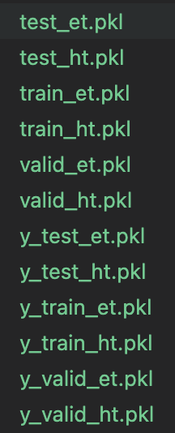
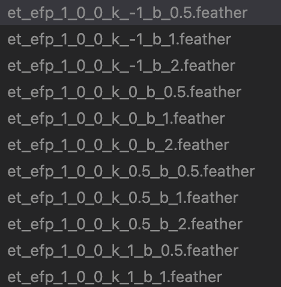

# Deep Learning Tutorial #3.a
## Ref.
- [Collado, Julian, et al. "Learning to identify electrons." Physical Review D 103.11 (2021): 116028.](https://journals.aps.org/prd/abstract/10.1103/PhysRevD.103.116028)
- [Collado, Julian, et al. "Learning to isolate muons." Journal of High Energy Physics 2021.10 (2021): 1-17.](https://link.springer.com/content/pdf/10.1007/JHEP10(2021)200.pdf)
## IAM
- 한상곤(Sangkon Han, sangkon@pusan.ac.kr), CS.

---
## Day.3 (execrcise) `Learning to Identify Electrons`

> `Learning to Identify Electrons` 논문을 재현해 보자.

### Index
- ~~Day.1 : (Intro) - [Hands-On](https://github.com/sigmadream/learning-to-identify-electrons-clone/blob/main/notebooks/day1-hands-on.ipynb)~~
- ~~Day.2 : (Example) - [`LeNet-5`](http://vision.stanford.edu/cs598_spring07/papers/Lecun98.pdf) 구현해보기~~
- Day.3 : (execrcise) - [`Learning to Identify Electrons`]((https://journals.aps.org/prd/abstract/10.1103/PhysRevD.103.116028)) 재현 준비
- Day.4 : (execrcise) - [`Learning to Identify Electrons`]((https://journals.aps.org/prd/abstract/10.1103/PhysRevD.103.116028)) 재현
- Day.5 : (practice) - [`Learning to Isolate Muons`](https://link.springer.com/article/10.1007/JHEP10(2021)200) 재현

---
## 1. 논문(`Learning to Identify Electrons.`) 살펴보기

> 사고실험; 사물의 실체나 개념을 이해하기 위해 가상의 시나리오를 이용하는 것.

---
## 몇가지 문제

- [`ROOT`](https://root.cern/get_started/)라는 도구가 필요하지만, 해당 도구를 당장 이해하거나 배울 수 있는 방법이 없음

- 도메인 지식(domain knowledge)이 없기 때문에 데이터에 대한 이해를 할 수 없음
    - `et`, `ht`, `mass` 등

---
## 그럼 공대 방식으로 문제를 해결해보자.

> 이 논문의 내용에 집중하는 것이 아니라, 제공된 코드를 통해서 '구조'를 먼저 파악하자.

이러한 주장이 가능한 이유는 ~~(대부분의)~~ 딥러닝 논문은 '데이터, 훈련, 평가'로 구성되어 있고, 데이터에 대한 이해도가 논문에 제시된 훈련 모델을 이해하는데 많은 영향을 주기 때문.

---
## 데이터 관련 코드를 확인해보자.
```python
x, y = load_data('mass', 'test')
print(x.shape, y.shape) # (42977, 1) (42977,)
dataset, y = load_combined_data('et and hl', 'test')
print(len(dataset)) # 2
for d in dataset:
    print(d.shape) # (42977, 31, 31, 1)
                   # (42977, 7)
dataset, y = load_combined_data('hl_and_mass', 'test')
print(len(dataset)) # 2
for d in dataset:
    print(d.shape) # (42977, 7)
                   # (42977, 1) 
```

---
## 데이터 관련 코드를 확인해보자 (Cont.)
```
features = []
features.append('et_and_ht')
features.append('et_and_ht_and_hl')
features.append('hl_and_mass')
for feature in features:
    x, y = load_combined_data(feature, 'test')
    print(feature, len(x), type(x))
    for d in x:
        print(d.shape)
```
---
## 데이터 관련 코드를 확인해보자 (Cont.)
```
et_and_ht 2 <class 'list'>
(42977, 31, 31, 1)
(42977, 32, 32, 1)
et_and_ht_and_hl 3 <class 'list'>
(42977, 31, 31, 1)
(42977, 32, 32, 1)
(42977, 7)
hl_and_mass 2 <class 'list'>
(42977, 7)
(42977, 1)
```
---
## 데이터 출처는 어디인가
```
def load_data(feature, dset, only_x=False, unscaled=False):
    if unscaled:
        h5_name = 'unscaled_data.h5'
    else:
        h5_name = 'data.h5'
    assert True, 'modify ...'
    with h5py.File('data/'+h5_name, 'r') as hf:
        x = hf['%s/%s'%(feature, dset)]
        x = x[:]
        y = hf['y/%s'%dset]
        y = y[:]
    if only_x:
        return x
    else:
        return [x, y]
```

---
## H5 파일은 무엇인가?
- 계층적 데이터 형식(hierarchical data format, HDF)은 The HDF Group에 의해 관리되고 있는 대용량의 데이터를 저장하기 위한 파일 형식으로, 많은 양의 데이터를 다차원 배열 형태로 저장
- 형식은 주로 빠른 검색 및 분석을 위해 잘 구성된 과학 데이터를 저장하는 데 사용하며, NCSA(National Center for Supercomputing Applications)에서 개발했으며 현재는 NASA에서 과학 데이터를 저장하는 표준 방법으로 선택
---
## H5를 확인하는 방법
```
$ brew install hdfview
```


---
## H5 예제

```
f = h5py.File('file.h5', 'r')
# h5 키 확인
keys = f.keys()
 
dset = '' 
fIndex = -1 
f_name = ''
 
arrLen = len(keys)

# 첫번째이미지만 확인
for i, f_name in enumerate(keys):
    dset = f[f_name] 
    break

# 데이터 추출
data = np.array(dset[:,:,:])
retval, buffer = cv2.imencode('.png', data)
png_as_text = base64.b64encode(buffer)
imgForm = "data:image/png;base64, "
imgForm += png_as_text.decode("utf-8") 
```

---
## 실제 `data.h5` 파일을 개별적인 파일로 풀어내면?

```
df = h5py.File("data/raw/data.h5", mode="r")
dtypes = ["et", "ht"]
splits = ["test", "train", "valid"]
data_types = [(x, y) for x in dtypes for y in splits]
```
> 나머지 코드는 `src/01_generate_prep_data.py` 참고.

---
## pkl 파일은 뭔가요?

- `pickle`은 문자/문자열 상태의 데이터가 아닌 파이썬 객체를 바이너리 파일로 저장하는 것으로 dictionary, list, tuple과 같은 형태로 필요한 부분을 저장할 때 활용

- 일반 문자열을 사용하는 경우 필요한 부분을 전처리 과정을 통해서 파싱(parsing)해야 하지만, pickle은 이미 필요한 형태대로 저장이 되어 있기 때문에 훨씬 검색이 빠름

- pickle module은 압축을 풀면서 관련 코드가 실행되기 때문에 보안에 매우 취약



---
## Feather 파일


- Pandas 데이터 프레임을 파일형태로 저장하는 다양한 방식이 있는데, 대부분의 수업에선 CSV를 사용하지만, 거의 대부분의 연구자들은 `Feather`를 사용

> Feather provides binary columnar serialization for data frames. It is designed to make reading and writing data frames efficient, and to make sharing data across data analysis languages easy. This initial version comes with bindings for python (written by Wes McKinney) and R (written by Hadley Wickham).

---


---
## 도대체 왜 데이터를 이렇게 복잡하게 처리 하는걸까?
- 일반적으로 많은 연구자들의 출판물에선 딥러닝의 레이어를 제공하는 경우가 존재
    - https://arxiv.org/abs/1409.1556
- 데이터가 공개되어 있다고 가정했을 때 전처리의 경우 컴퓨팅 환경을 포함해서 운영체제까지 광범위하게 영향을 미치는데, 전처리 과정을 외부에 공개할 때 동료평가자들이 해당 코드를 완벽하게 실행시킬 수 있을지에 대해선 다들 의문이 있음
- 따라서 전처리된 결과를 '손실'과 '유실'없이 대부분의 플랫폼에서 사용할 수 있도록 배포하는 것을 연구자들이 선호함
    - 또 다른 예로 `NetCDF(Network Common Data Form)`은 배열 지향적인 과학 데이터를 생성, 액세스 및 공유하도록 지원하는 소프트웨어 라이브러리 및 시스템 독립적인 데이터 형식의 집합, 기상 데이터의 표준으로 활용

---
## 중복 데이터 제거

> `src/03_identify_duplicate_efp.py`를 참고.

---
## 시각화

> `src/04_04_generate_efp_graphs.py`를 참고.

---


---
## EnergyFlow - 입자 물리학 도구 모음
- https://energyflow.network
- Komiske, Patrick T., Eric M. Metodiev, and Jesse Thaler. "Energy flow polynomials: A complete linear basis for jet substructure." Journal of High Energy Physics 2018.4 (2018): 1-54.

---
## 그렇다면 이제 남은 것은 CNN 구조!