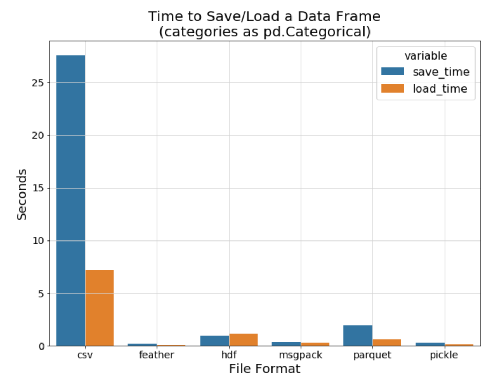
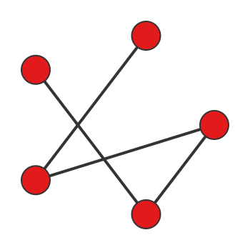

# Deep Learning Tutorial #3
## Ref.
- [Collado, Julian, et al. "Learning to identify electrons." Physical Review D 103.11 (2021): 116028.](https://journals.aps.org/prd/abstract/10.1103/PhysRevD.103.116028)
- [Collado, Julian, et al. "Learning to isolate muons." Journal of High Energy Physics 2021.10 (2021): 1-17.](https://link.springer.com/content/pdf/10.1007/JHEP10(2021)200.pdf)
## IAM
- 한상곤(Sangkon Han, sangkon@pusan.ac.kr), CS.

---
## Day.3 (execrcise) `Learning to Identify Electrons`

> `Learning to Identify Electrons` 논문을 재현해 보자.

### Index
- ~~Day.1 : (Intro) - [Hands-On](https://github.com/sigmadream/learning-to-identify-electrons-clone/blob/main/notebooks/day1-hands-on.ipynb)~~
- ~~Day.2 : (Example) - [`LeNet-5`](http://vision.stanford.edu/cs598_spring07/papers/Lecun98.pdf) 구현해보기~~
- Day.3 : (execrcise) - [`Learning to Identify Electrons`]((https://journals.aps.org/prd/abstract/10.1103/PhysRevD.103.116028)) 재현 준비
- Day.4 : (execrcise) - [`Learning to Identify Electrons`]((https://journals.aps.org/prd/abstract/10.1103/PhysRevD.103.116028)) 재현
- Day.5 : (practice) - [`Learning to Isolate Muons`](https://link.springer.com/article/10.1007/JHEP10(2021)200) 재현

---
## 1. 논문(`Learning to Identify Electrons.`) 살펴보기
> 사고실험; 사물의 실체나 개념을 이해하기 위해 가상의 시나리오를 이용하는 것.

---
### 1.1 우리가 구현을 원하는 것
- `CNN`을 기반으로 한 분류 모델(레이어)
- 논문의 9p에 있는 내용
    - 대부분의 내용은 이해 가능


---
### 1.2 우리가 준비해야 할 것
- 해당 논문에 사용된 데이터
    - `unscaled_data.h5`, `data.h5`
    - muons 논문에서 `efps.h5` 사용

---
### 1.3 우리가 아는 것과 모르는 것
- 아는 것
    - 간단한 Python 사용방법
    - CNN 구조와 간단한 구현
- 모르는 것
    - `unscaled_data.h5`, `data.h5` 데이터 구조
    - 논문에서 제안한 CNN 구조 재현 방법

---
### 1.4 논문 재현의 경우 초기 및 다른 분야의 연구자가 가지는 문제점
- [`ROOT`](https://root.cern/get_started/)라는 도구가 필요하지만, 해당 도구를 이해하거나 배우기 위한 사전 지식이 없음

- 도메인 지식(domain knowledge)이 없기 때문에 데이터에 대한 이해를 할 수 없음
    - `et`, `ht`, `mass` 등 논문에서 사용되는 약어(abbreviation)에 대한 사전 지식이 없어서 데이터를 정확하게 파악하기 힘듬

---
## 2. CS 혹은 개발자의 관점에서 해당 논문을 재현해보자.

---
### 2.1 CS 전공자가 다른 분야의 논문을 재현할 때 집중하는 것
> 이 논문의 내용이 아니라, 읽고 있는 논문이나 해당 논문에서 제공하는 조각 코드(code snippet)를 통해서 '구조'를 먼저 파악.

이러한 ~~터무니 없는~~ 주장이 가능한 이유는 ~~(대부분의)~~ 딥러닝 논문은 `데이터, 훈련, 평가`로 구성되어 있고(잘 알려진 구조), 데이터에 대한 이해도 뿐만 아니라 `데이터 형식`이 훈련 모델의 핵심적인 사항을 결정하는데 영향을 주는 경우가 많음

---
### 2.2 데이터 구조에 대한 이해도가 전체 맥락을 결정


> How data scientists spend their time (Image courtesy Anaconda "2020 State of Data Science: Moving From Hype Toward Maturity.")

---
### 2.3.a 제공된 데이터 관련 코드를 확인해보자.
> `EID/train/data_loader.py` 참고
```python
x, y = load_data('mass', 'test')
print(x.shape, y.shape) # (42977, 1) (42977,)
dataset, y = load_combined_data('et and hl', 'test')
print(len(dataset)) # 2
for d in dataset:
    print(d.shape) # (42977, 31, 31, 1)
                   # (42977, 7)
dataset, y = load_combined_data('hl_and_mass', 'test')
print(len(dataset)) # 2
for d in dataset:
    print(d.shape) # (42977, 7)
                   # (42977, 1) 
```

---
### 2.3.b 데이터 관련 코드를 확인해보자 (Cont.)
> `EID/train/data_loader.py` 참고
```python
features = []
features.append('et_and_ht')
features.append('et_and_ht_and_hl')
features.append('hl_and_mass')
for feature in features:
    x, y = load_combined_data(feature, 'test')
    print(feature, len(x), type(x))
    for d in x:
        print(d.shape)
```
---
### 2.3.c 데이터 관련 코드를 확인해보자 (Cont.)
> `EID/train/data_loader.py` 참고
```pyton
et_and_ht 2 <class 'list'>
(42977, 31, 31, 1)
(42977, 32, 32, 1)
et_and_ht_and_hl 3 <class 'list'>
(42977, 31, 31, 1)
(42977, 32, 32, 1)
(42977, 7)
hl_and_mass 2 <class 'list'>
(42977, 7)
(42977, 1)
```
---
### 2.4 데이터 출처는 어디인가
> `EID/train/data_loader.py` 참고
```
def load_data(feature, dset, only_x=False, unscaled=False):
    if unscaled:
        h5_name = 'unscaled_data.h5'
    else:
        h5_name = 'data.h5'
    assert True, 'modify ...'
    with h5py.File('data/'+h5_name, 'r') as hf:
        x = hf['%s/%s'%(feature, dset)]
        x = x[:]
        y = hf['y/%s'%dset]
        y = y[:]
    if only_x:
        return x
    else:
        return [x, y]
```

---
### 2.5 H5 파일은 무엇인가?
- 계층적 데이터 형식(hierarchical data format, `HDF`)은 `The HDF Group`에 의해 관리되고 있는 대용량의 데이터를 저장하기 위한 파일 형식으로, 많은 양의 데이터를 `다차원 배열 형태`로 저장
- 빠른 검색 및 분석을 위해 잘 구성된 과학 데이터를 저장하는 데 사용하며, `NCSA`(National Center for Supercomputing Applications)에서 개발했으며 현재는 NASA에서 과학 데이터를 저장하는 표준 방법으로 선택

---
### 2.6 H5를 확인하는 방법
```zsh
$ brew install hdfview
```


---
### 2.7 H5를 다루는 간단한 예제

```python
# 파일 열기
f = h5py.File('file.h5', 'r')

# H5에 저장된 Key를 확인
keys = f.keys()

# 변수 초기화 
d_set = '' 
f_name = ''
 
arrLen = len(keys)

# 첫번째 데이터만 추출
for i, f_name in enumerate(keys):
    d_set = f[f_name] 
    break

# 데이터를 Numpy 배열로 변환
data = np.array(d_set[:,:,:])

# 배열을 이미지로 변환
retval, buffer = cv2.imencode('.png', data)
png_as_text = base64.b64encode(buffer)
imgForm = "data:image/png;base64, "
imgForm += png_as_text.decode("utf-8") 
```

---
### 2.8 실제 `data.h5` 파일을 개별적인 파일로 풀어내면?
> `src/01_generate_prep_data.py` 참고.
```python
df = h5py.File("data/raw/data.h5", mode="r")
dtypes = ["et", "ht"]
splits = ["test", "train", "valid"]
data_types = [(x, y) for x in dtypes for y in splits]
```

---
### 2.9 H5를 풀었더니 `pkl` 파일이 생성되는데 그건 뭔가요?
- `pickle`은 Python 객체를 바이너리 파일로 저장하는 것으로 dictionary, list, tuple과 같은 형태로 필요한 부분을 저장할 때 활용하는 것으로 검색이 빠름
- pickle module은 압축을 풀면서 관련 코드가 실행되기 때문에 보안에 매우 취약
- (여러분에게) 유명한 `pkl`과 유사한 방식
    - `boost::serialize`
    - `Google Protocol Buffer`

---
### 2.10 `pkl`을 해결했더니 `feather` 파일이 나오는데요?!
- Pandas 데이터 프레임을 파일형태로 저장하는 다양한 방식이 있는데, 대부분의 수업에선 CSV를 사용하지만, 거의 대부분의 연구자들은 `Feather`를 사용
> Feather provides binary columnar serialization for data frames. It is designed to make reading and writing data frames efficient, and to make sharing data across data analysis languages easy. This initial version comes with bindings for python (written by Wes McKinney) and R (written by Hadley Wickham).

---


---
### 2.11 도대체 왜 이런식으로 복잡하게 데이터를 가공/처리 하는거죠?
- 일반적으로 많은 연구자들의 출판물에선 딥러닝의 레이어에 대한 정보는 대부분 제공
    - https://arxiv.org/abs/1409.1556
- 현재는 데이터를 함께 공개하는 경향이 많은데, 동료 평가자가 전처리 과정이 미숙하거나 컴퓨팅 환경 및 플랫폼(운영체제) 등 전처리 과정에서 오류가 발생할 수 있는 환경이 광범위함
    - 전처리 과정을 외부에 공개할 때 동료평가자들이 해당 코드를 완벽하게 실행시킬 수 있을지에 대해선 다들 의문이 있고, 평가 대상자들이 논문을 재현하는데 전처리를 해야 되는지에 대해서 의문이 있음
- 전처리된 결과를 '손실'과 '유실'없이 대부분의 플랫폼에서 사용할 수 있도록 배포하는 것을 연구자들이 선호함
    - 예를 들어 `NetCDF(Network Common Data Form)`은 배열 지향적인 과학 데이터를 생성, 액세스 및 공유하도록 지원하는 소프트웨어 라이브러리 및 시스템 독립적인 데이터 형식의 집합, 기상 데이터의 표준으로 활용

---
### 2.12 끝난 것 같지만 "중복 데이터 제거"를 해보죠.
> `src/03_identify_duplicate_efp.py`를 참고.

---
### 2.13 아직 멀었습니다. 데이터의 끝은 반드시 시각화로!
> `src/04_04_generate_efp_graphs.py`를 참고.

---


---
### 2.14 저건 어떻게 "EnergyFlow - 입자 물리학 도구 모음"를 사용
- https://energyflow.network
- Komiske, Patrick T., Eric M. Metodiev, and Jesse Thaler. "Energy flow polynomials: A complete linear basis for jet substructure." Journal of High Energy Physics 2018.4 (2018): 1-54.
