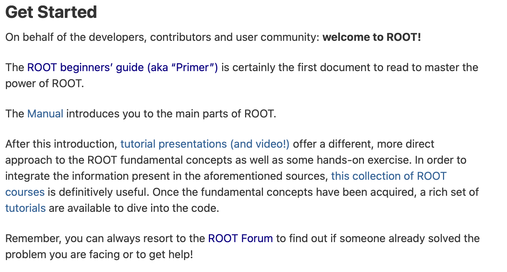
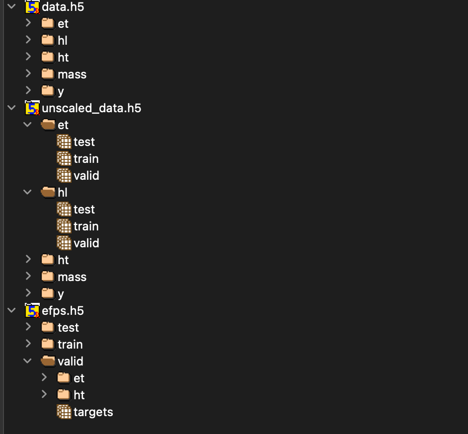

# Deep Learning Tutorial #3.a
## Ref.
- [Collado, Julian, et al. "Learning to identify electrons." Physical Review D 103.11 (2021): 116028.](https://journals.aps.org/prd/abstract/10.1103/PhysRevD.103.116028)
- [Collado, Julian, et al. "Learning to isolate muons." Journal of High Energy Physics 2021.10 (2021): 1-17.](https://link.springer.com/content/pdf/10.1007/JHEP10(2021)200.pdf)
## IAM
- 한상곤(Sangkon Han, sangkon@pusan.ac.kr), CS.

---
## Day.3 (execrcise) `Learning to Identify Electrons`

> `Learning to Identify Electrons` 논문을 재현해 보자.

### Index
- ~~Day.1 : (Intro) - [Hands-On](https://github.com/sigmadream/learning-to-identify-electrons-clone/blob/main/notebooks/day1-hands-on.ipynb)~~
- ~~Day.2 : (Example) - [`LeNet-5`](http://vision.stanford.edu/cs598_spring07/papers/Lecun98.pdf) 구현해보기~~
- Day.3 : (execrcise) - [`Learning to Identify Electrons`]((https://journals.aps.org/prd/abstract/10.1103/PhysRevD.103.116028)) 재현 준비
- Day.4 : (execrcise) - [`Learning to Identify Electrons`]((https://journals.aps.org/prd/abstract/10.1103/PhysRevD.103.116028)) 재현
- Day.5 : (practice) - [`Learning to Isolate Muons`](https://link.springer.com/article/10.1007/JHEP10(2021)200) 재현

---
## 1. 논문(`Learning to Identify Electrons.`) 살펴보기

> 사고실험; 사물의 실체나 개념을 이해하기 위해 가상의 시나리오를 이용하는 것.

---
## 몇가지 문제

- [`ROOT`](https://root.cern/get_started/)라는 도구가 필요하지만, 해당 도구를 당장 이해하거나 배울 수 있는 방법이 없음

- 도메인 지식(domain knowledge)가 없기 때문에 데이터에 대한 이해를 할 수 없음
    - `et`, `ht`, `mass` 등

---
## 그럼 공대 방식으로 문제를 해결해보자.

> 이 논문의 내용을 잠시 잊고, 제공된 코드를 통해서 '구조'를 먼저 학습하자.

- 딥러닝 논문의 대표적인 구조 '데이터, 훈련, 평가' 중 데이터 관련 부분을 먼저 확인해보자.

---
## 데이터 관련 코드를 확인해보자.
```python
x, y = load_data('mass', 'test')
print(x.shape, y.shape) # (42977, 1) (42977,)
dataset, y = load_combined_data('et and hl', 'test')
print(len(dataset)) # 2
for d in dataset:
    print(d.shape) # (42977, 31, 31, 1)
                   # (42977, 7)
dataset, y = load_combined_data('hl_and_mass', 'test')
print(len(dataset)) # 2
for d in dataset:
    print(d.shape) # (42977, 7)
                   # (42977, 1) 
```

---
## 데이터 관련 코드를 확인해보자 (Cont.)
```
features = []
features.append('et_and_ht')
features.append('et_and_ht_and_hl')
features.append('hl_and_mass')
for feature in features:
    x, y = load_combined_data(feature, 'test')
    print(feature, len(x), type(x))
    for d in x:
        print(d.shape)
```
---
## 데이터 관련 코드를 확인해보자 (Cont.)
```
et_and_ht 2 <class 'list'>
(42977, 31, 31, 1)
(42977, 32, 32, 1)
et_and_ht_and_hl 3 <class 'list'>
(42977, 31, 31, 1)
(42977, 32, 32, 1)
(42977, 7)
hl_and_mass 2 <class 'list'>
(42977, 7)
(42977, 1)
```
---
## 데이터 출처는 어디인가
```
def load_data(feature, dset, only_x=False, unscaled=False):
    if unscaled:
        h5_name = 'unscaled_data.h5'
    else:
        h5_name = 'data.h5'
    assert True, 'modify ...'
    with h5py.File('data/'+h5_name, 'r') as hf:
        x = hf['%s/%s'%(feature, dset)]
        x = x[:]
        y = hf['y/%s'%dset]
        y = y[:]
    if only_x:
        return x
    else:
        return [x, y]
```

---
## H5 파일은 무엇인가?
- 계층적 데이터 형식(hierarchical data format, HDF)은 The HDF Group에 의해 관리되고 있는 대용량의 데이터를 저장하기 위한 파일 형식으로, 많은 양의 데이터를 다차원 배열 형태로 저장
- 형식은 주로 빠른 검색 및 분석을 위해 잘 구성된 과학 데이터를 저장하는 데 사용하며, NCSA(National Center for Supercomputing Applications)에서 개발했으며 현재는 NASA에서 과학 데이터를 저장하는 표준 방법으로 선택
---
## H5를 확인하는 방법
```
$ brew install hdfview
```


---
## H5 예제

```
f = h5py.File('file.h5', 'r')
# h5 키 확인
keys = f.keys()
 
dset = '' 
fIndex = -1 
f_name = ''
 
arrLen = len(keys)

# 첫번째이미지만 확인
for i, f_name in enumerate(keys):
    dset = f[f_name] 
    break

# 데이터 추출
data = np.array(dset[:,:,:])
retval, buffer = cv2.imencode('.png', data)
png_as_text = base64.b64encode(buffer)
imgForm = "data:image/png;base64, "
imgForm += png_as_text.decode("utf-8") 
```

---

