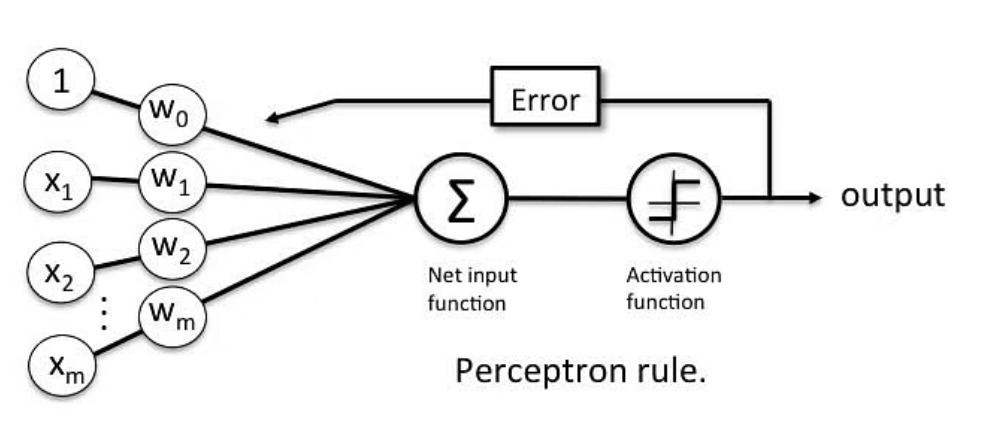
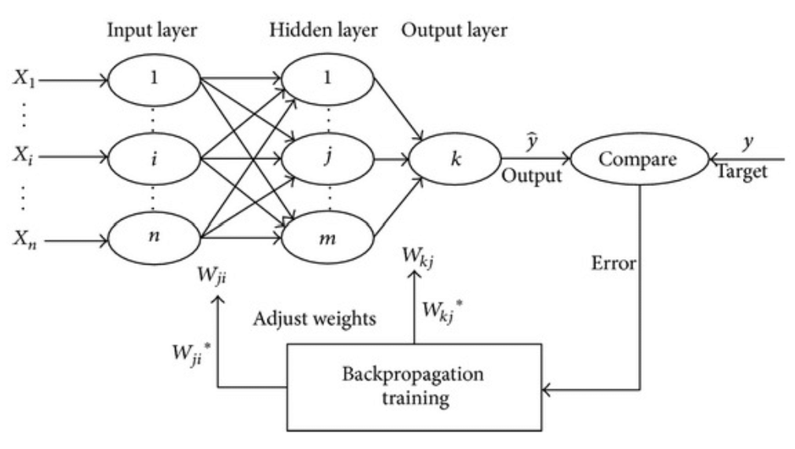
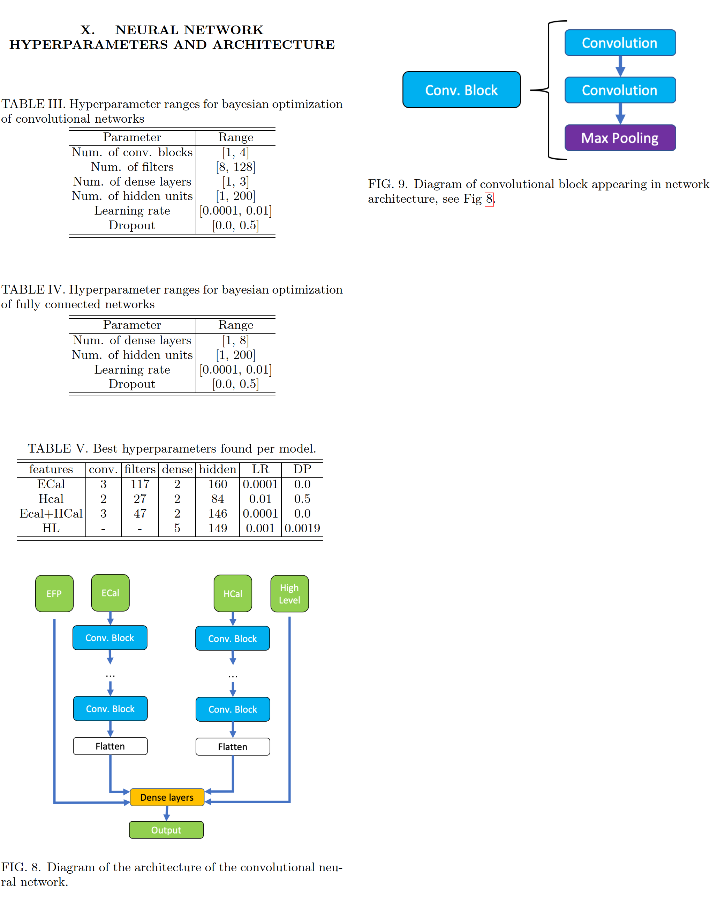

# Deep Learning Tutorial #4
## Ref.
- [Collado, Julian, et al. "Learning to identify electrons." Physical Review D 103.11 (2021): 116028.](https://journals.aps.org/prd/abstract/10.1103/PhysRevD.103.116028)
- [Collado, Julian, et al. "Learning to isolate muons." Journal of High Energy Physics 2021.10 (2021): 1-17.](https://link.springer.com/content/pdf/10.1007/JHEP10(2021)200.pdf)
## IAM
- 한상곤(Sangkon Han, sangkon@pusan.ac.kr), CS.

---
## Day.4 (execrcise) `Learning to Identify Electrons`

> `Learning to Identify Electrons` 논문을 재현해 보자.

### Index
- ~~Day.1 : (Intro) - [Hands-On](https://github.com/sigmadream/learning-to-identify-electrons-clone/blob/main/notebooks/day1-hands-on.ipynb)~~
- ~~Day.2 : (Example) - [`LeNet-5`](http://vision.stanford.edu/cs598_spring07/papers/Lecun98.pdf) 구현해보기~~
- ~~Day.3 : (execrcise) - [`Learning to Identify Electrons`]((https://journals.aps.org/prd/abstract/10.1103/PhysRevD.103.116028)) 재현 준비~~
- Day.4 : (execrcise) - [`Learning to Identify Electrons`]((https://journals.aps.org/prd/abstract/10.1103/PhysRevD.103.116028)) 재현
- Day.5 : (practice) - [`Learning to Isolate Muons`](https://link.springer.com/article/10.1007/JHEP10(2021)200) 재현

---
## Review. Again CNN

---
### 1.a previous story
- 실험 환경 설정에 관한 안내
- AI, 머신러닝, 딥러닝에 대한 짧은 소개    


---
### 1.b previous story
- Perceptron(퍼셉트론), 다수의 값을 입력받아 하나의 값으로 출력하는 알고리즘($y=ax+b$)

- MultiLayer Perceptron(다층 퍼셉트론  혹은 MLP), 

- 은닉층이 2개 이상인 신경망을 심층 신경망이라 하는데, 이 때 심층 신경망을 학습시키는 과정을 '딥러닝'이라 함.

---
### 1.c CNN
- Convolutional Layer
    - filter(or image)
    - kernel
    - stride
    - padding
- Pooling Layer
    - avg
    - max
> https://sigmadream.github.io/cnn-vis/


---
### 1.d Check Python Syntax
> https://docs.python.org/3/tutorial/index.html
- [Data Structures](https://docs.python.org/3/tutorial/datastructures.html)
- [Function](https://docs.python.org/3/tutorial/controlflow.html#more-on-defining-functions)
- [Classes](https://docs.python.org/3/tutorial/classes.html)

---
## 2. 구현 시작

---


---
### 2.1.a 우리가 알고 있는 것 
```python
et_and_ht 2 <class 'list'>
(42977, 31, 31, 1)
(42977, 32, 32, 1)
et_and_ht_and_hl 3 <class 'list'>
(42977, 31, 31, 1)
(42977, 32, 32, 1)
(42977, 7)
hl_and_mass 2 <class 'list'>
(42977, 7)
(42977, 1)
```

---
### 2.1.b 우리가 알고 있는 것
```shell
{'feature': 'hl', 'filters': 16, 'numConvBlocks': 1, 'p': 0, 'optimizer': 'adam', 'epochs': 100, 'batchSize': 128, 'iso_positions': (), 'efp_positions': (), 'numLayers': 5, 'units': 149, 'lr': 0.001, 'dp': 0.0019}
{'feature': 'et_and_ht', 'filters': 47, 'numConvBlocks': 3, 'p': 0, 'optimizer': 'adam', 'epochs': 100, 'batchSize': 128, 'iso_positions': (), 'efp_positions': (), 'numLayers': 2, 'units': 146, 'lr': 0.0001, 'dp': 0.0}
{'feature': 'et', 'filters': 117, 'numConvBlocks': 3, 'p': 0, 'optimizer': 'adam', 'epochs': 100, 'batchSize': 128, 'iso_positions': (), 'efp_positions': (), 'numLayers': 2, 'units': 160, 'lr': 0.0001, 'dp': 0.0}
{'feature': 'ht', 'filters': 27, 'numConvBlocks': 2, 'p': 0, 'optimizer': 'adam', 'epochs': 100, 'batchSize': 128, 'iso_positions': (), 'efp_positions': (), 'numLayers': 2, 'units': 84, 'lr': 0.01, 'dp': 0.5}
{'feature': 'et_and_ht_and_hl', 'filters': 34, 'numConvBlocks': 3, 'p': 0, 'optimizer': 'adam', 'epochs': 100, 'batchSize': 128, 'iso_positions': (), 'efp_positions': (), 'numLayers': 2, 'units': 154, 'lr': 0.0001, 'dp': 0.0}
{'feature': 'mass', 'filters': 16, 'numConvBlocks': 1, 'p': 0, 'optimizer': 'adam', 'epochs': 100, 'batchSize': 128, 'iso_positions': (), 'efp_positions': (), 'numLayers': 3, 'units': 10, 'lr': 0.01, 'dp': 0.0}
{'feature': 'hl_and_mass', 'filters': 16, 'numConvBlocks': 1, 'p': 0, 'optimizer': 'adam', 'epochs': 100, 'batchSize': 128, 'iso_positions': (), 'efp_positions': (), 'numLayers': 3, 'units': 109, 'lr': 0.0013, 'dp': 0.0}
```
---
### 2.2 가장 작은 것 부터 구현

```python
def conv_block(layer, filters, activation='relu'):
    layer=Conv2D(filters, kernel_size=(3, 3),activation=activation,padding='same')(layer)
    layer=Conv2D(filters, kernel_size=(3, 3), activation=activation,padding='same')(layer)
    layer=MaxPooling2D(pool_size=(2, 2),padding='same')(layer)
    return layer 
```

> q1. 그런데 이 함수는 어떻게 동작하는 건가요?
> q2. 이거 실행은 어떻게?

---
### 2.3.a TF에서 모델을 작성하는 3가지 기본 구조
- Sequential
```
# build a model (5 layers)
model = tf.keras.Sequential([
    # 1. filter(kernel channel) = 32, kernel = 3, relu, conv2d layer
    tf.keras.layers.Conv2D(32, 3, activation='relu'),
    # 2. filter = 64, kernel = 3, relu, conv2d layer
    tf.keras.layers.Conv2D(64, 3, activation='relu'),
    # 3. flatten layer
    tf.keras.layers.Flatten(),
    # 4. output = 128 nodes, relu, fully-connected dense layer
    tf.keras.layers.Dense(128, activation='relu'),
    # 5. ouput = class (data), relu, fully-connected dense layer
    tf.keras.layers.Dense(10, activation='softmax')
])
```

---
### 2.3.b TF에서 모델을 작성하는 3가지 기본 구조
- Functional
```
# input layer
inputs = tf.keras.Input(shape = (28, 28, 1))
# 1. filter(kernel channel) = 32, kernel = 3, relu, conv2d layer
x = tf.keras.layers.Conv2D(32, 3, activation = 'relu')(inputs)
# 2. filter = 64, kernel = 3, relu, conv2d layer
x = tf.keras.layers.Conv2D(64, 3, activation = 'relu')(x)
# 3. flatten layer
x = tf.keras.layers.Flatten()(x)
# 4. output = 128 nodes, relu, fully-connected dense layer
x = tf.keras.layers.Dense(128, activation = 'relu')(x)
# 5. ouput = class (data), relu, fully-connected dense layer
outputs = tf.keras.layers.Dense(10, activation = 'softmax')(x)

# build a model (5 layers)
model = tf.keras.Model(inputs = inputs, outputs = outputs)
```

---
### 2.3.c TF에서 모델을 작성하는 3가지 기본 구조
- Subclassing
```
class MNISTModel(tf.keras.Model):
    def __init__(self):
        super(MNISTModel, self).__init__()
        # 1. filter(kernel channel) = 32, kernel = 3, relu, conv2d layer
        self.Conv2D1 = tf.keras.layers.Conv2D(32, 3, activation = 'relu')
        # 2. filter = 64, kernel = 3, relu, conv2d layer
        self.Conv2D2 = tf.keras.layers.Conv2D(64, 3, activation = 'relu')
        # 3. flatten layer
        self.Flatten = tf.keras.layers.Flatten()
        # 4. output = 128 nodes, relu, fully-connected dense layer
        self.Dense1 = tf.keras.layers.Dense(128, activation = 'relu')
        # 5. ouput = class (data), relu, fully-connected dense layer
        self.Dense2 = tf.keras.layers.Dense(10, activation = 'softmax')

    def call(self, x):
        x = self.Conv2D1(x)
        x = self.Conv2D2(x)
        x = self.Flatten(x)
        x = self.Dense1(x)
        x = self.Dense2(x)
        return x
```

---
### 2.4 가장 작은 것 부터 이해

```python
def conv_block(layer, filters, activation='relu'):
    layer=Conv2D(filters, kernel_size=(3, 3),activation=activation,padding='same')(layer)
    layer=Conv2D(filters, kernel_size=(3, 3), activation=activation,padding='same')(layer)
    layer=MaxPooling2D(pool_size=(2, 2),padding='same')(layer)
    return layer 
```

> ~~q1. 그런데 이 함수는 어떻게 동작하는 건가요?~~ => Functional
> q2. 이거 실행은 어떻게?

---
### 2.5 가장 작은 것 부터 실행
```python
def conv_block(layer, filters, activation='relu'):
    layer=Conv2D(filters, kernel_size=(3, 3),activation=activation,padding='same')(layer)
    layer=Conv2D(filters, kernel_size=(3, 3), activation=activation,padding='same')(layer)
    layer=MaxPooling2D(pool_size=(2, 2),padding='same')(layer)
    return layer 
```
> ~~q1. 그런데 이 함수는 어떻게 동작하는 건가요?~~ => Functional
> q2. 이거 실행은 어떻게? 예상되는 결과값은?
```python
input=Input(shape=(31, 31, 1))
layer=conv_block(input, filters=117)
KerasTensor(type_spec=TensorSpec(shape=(None, 31, 31, 117), dtype=tf.float32, name=None), name='conv2d_7/Relu:0', description="created by layer 'conv2d_7'")
```

---
### 2.6.a 작은 구성요소가 반복적으로 사용
- 언제나 Input과 Output 부터
```python
# 초기값
feature = params['feature']
input_img = []
flat_layers = []
towers = []

for pos, input_i in enumerate(params['input_shapes']):
    if len(input_i) == 3:
        input_img.append(Input(shape=input_i, name='image_%i'%pos))
    else:
        flat_layers.append(Input(shape=input_i, name='flat_%i'%pos))
all_inputs = input_img+flat_layers
```

---
### 2.6.a 작은 구성요소가 반복적으로 사용
- 언제나 Input과 Output 부터
```python
...
if params['optimizer'] == 'adam':
    optimizer = keras.optimizers.Adam(lr=params['lr'])   
model.compile(loss=keras.losses.binary_crossentropy, optimizer=optimizer)
my_model = model
return my_model
```

---
### 2.7. 그렇다면 가장 간단한 예제를 선택
- 간단한 예제를 하나 선택(42977 x 7, hl)
- Input: Flatten(7)
- Dense + Dropout
- Dense + Dropout
- Dense + Dropout
- Dense + Dropout
- Dense
- Output: Dense(1)

> 전형적인 MLP

---
### 2.8 연결
```
x1  x2  x3
 \  /   /
  y1   /
   \  /
    y2

from keras.models import Model
from keras.layers import Dense, Input, concatenate

first_input = Input(shape=(2, ))
first_dense = Dense(1, )(first_input)

second_input = Input(shape=(2, ))
second_dense = Dense(1, )(second_input)

merge_one = concatenate([first_dense, second_dense])

third_input = Input(shape=(1, ))
merge_two = concatenate([merge_one, third_input])

model = Model(inputs=[first_input, second_input, third_input], outputs=merge_two)
```

---
### 2.9 레이어를 연결
```
if len(flat_layers) > 1:
    layer = keras.layers.concatenate(flat_layers, axis=-1)
else:
    layer = flat_layers[0]
```
